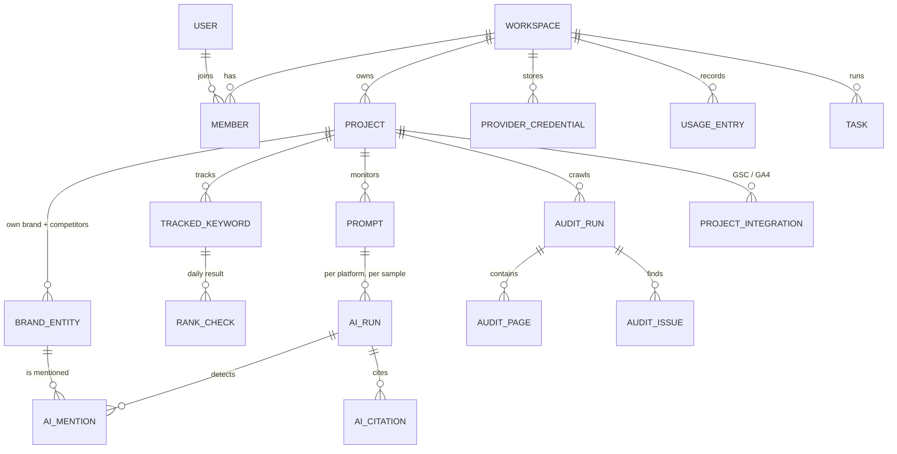

# Data model

The Prisma schema lives in `packages/db` (M1). This document defines the entities, the
rules every table follows, and how large time series are stored.

## Rules

1. **Tenant scoping.** Every tenant-owned row has `workspace_id`. Project-owned rows also have
   `project_id`. Repositories always filter by the workspace resolved from the request; a row
   is never loaded by ID alone.
2. **Identifiers.** Primary keys are UUIDs (`uuid`), v7 when generated by the application so
   they sort by creation time and work well for cursor pagination.
3. **Time.** All timestamps are `timestamptz`. Daily facts use a `date` column in the
   project's time zone.
4. **Money.** Provider costs are `numeric(12,6)` in USD.
5. **JSON.** `jsonb` is used for flexible payloads and is validated with Zod at the boundary.
6. **Shared market data.** Keyword metrics, domain metrics and DataForSEO locations are public
   market data, cached once per instance and shared by all workspaces.
7. **Large payloads** (raw SERP responses, full AI answers, crawl snapshots, PDFs) go to
   object storage; tables keep a storage key and a hash.
8. **Naming.** Tables and columns are `snake_case` in PostgreSQL, mapped to `camelCase` in Prisma.

## Core relationships

## Identity and tenancy

Managed by Better Auth; our extra fields are added through its schema options.

| Table | Key columns | Notes |
|---|---|---|
| `user` | id, email, name, email_verified, image, locale, two_factor_enabled | |
| `session` | id, user_id, token, expires_at, active_organization_id, ip_address, user_agent | httpOnly cookie |
| `account` | id, user_id, provider_id, account_id, password (hash) | credentials and OAuth logins |
| `verification` | id, identifier, value, expires_at | email verification, password reset |
| `organization` | id, name, slug, logo, metadata, **plan**, **settings** | shown in the product as **workspace** |
| `member` | id, organization_id, user_id, role | roles: `owner`, `admin`, `member`, `viewer` |
| `invitation` | id, organization_id, email, role, status, expires_at, inviter_id | |
| `apikey` | id, user_id, organization_id, prefix, hashed key, permissions, rate limits, expires_at | public API and MCP |

## Workspace-level entities

| Table | Key columns | Notes |
|---|---|---|
| `provider_credential` | id, workspace_id, provider, label, encrypted_secret (bytea), key_version, status, last_verified_at | providers: `DATAFORSEO`, `OPENAI`, `ANTHROPIC`, `GOOGLE_AI`, `OPENROUTER`, `PERPLEXITY`. Secrets are AES-256-GCM encrypted and never returned by the API |
| `usage_entry` | id, workspace_id, project_id?, task_id?, provider, operation, units, cost_usd, billed_to, created_at | append-only ledger, partitioned by month |
| `budget` | workspace_id, provider?, monthly_limit_usd, hard_stop, alert_thresholds | checked before paid jobs are enqueued |
| `task` | id, workspace_id, project_id?, type, status, progress, input, result, error, estimated_cost_usd, actual_cost_usd, idempotency_key, created_by, timestamps | user-visible background operation; unique (workspace_id, idempotency_key) |
| `audit_log` | id, workspace_id, actor_user_id?, actor_api_key_id?, action, target_type, target_id, metadata, ip, created_at | security-relevant actions |
| `notification` | id, workspace_id, user_id, type, title, body, link, read_at, created_at | in-app notifications |

## Provider cache

| Table | Key columns | Notes |
|---|---|---|
| `provider_cache` | key (hash of operation + normalized params), provider, operation, params, response (jsonb or storage key), cost_usd, fetched_at, expires_at | shared market data only; never caches tenant-private data such as Search Console |

## Projects

| Table | Key columns | Notes |
|---|---|---|
| `project` | id, workspace_id, name, slug, domain, include_subdomains, default_location_code, default_language_code, timezone, archived_at | `domain` is a normalized host; unique (workspace_id, slug) |
| `brand_entity` | id, workspace_id, project_id, kind (`OWN`/`COMPETITOR`), name, domains[], aliases[], color | one `OWN` entity per project; competitors are entities too, so rank tracking, AI mentions and share of voice use one definition |
| `project_member` | project_id, user_id, role | M4: restrict client viewers to specific projects |
| `project_integration` | id, project_id, type (`GSC`/`GA4`), connection_id, external_id, settings, last_synced_at | selected Search Console site or GA4 property |
| `google_connection` | id, workspace_id, google_email, scopes, encrypted_tokens, status, connected_by | OAuth tokens, encrypted |

## Rank tracking and keywords

| Table | Key columns | Notes |
|---|---|---|
| `keyword_metric` | keyword, location_code, language_code, search_volume, cpc, competition, keyword_difficulty, intent, monthly_searches, source, fetched_at | shared cache, PK (keyword, location_code, language_code) |
| `tracked_keyword` | id, workspace_id, project_id, keyword, location_code, language_code, device, search_engine, tags[], target_url, frequency, active | unique (project_id, keyword, location_code, language_code, device, search_engine) |
| `rank_check` | id, tracked_keyword_id, workspace_id, project_id, checked_on, checked_at, rank_group, rank_absolute, url, serp_features[], ai_overview_present, ai_overview_cited, featured_snippet_owned, competitor_ranks (jsonb), serp_snapshot_key, task_id | partitioned by month on `checked_on`; unique (tracked_keyword_id, checked_on) |
| `keyword_list`, `keyword_list_item` | list: id, workspace_id, project_id?, name · item: list_id, keyword, location_code, language_code, note | saved research |
| `dataforseo_location` | code, name, parent_code, country_iso, type | synced reference data |

`rank_group` is the organic position; `rank_absolute` counts every SERP element. Search
Console positions are **averages** and are stored separately (`gsc_*_daily`), never mixed
into `rank_check`.

## Search Console and Analytics facts

| Table | Key columns | Notes |
|---|---|---|
| `gsc_query_daily` | project_id, date, query, clicks, impressions, ctr, position | partitioned by month |
| `gsc_page_daily` | project_id, date, page, clicks, impressions, ctr, position | partitioned by month |
| `ga4_page_daily` | project_id, date, page, sessions, users, engaged_sessions, source_medium | M2+ |

## Site audit

| Table | Key columns | Notes |
|---|---|---|
| `audit_run` | id, workspace_id, project_id, status, trigger, config (max pages, depth, include/exclude patterns, render JS), stats, health_score, score_version, task_id, started_at, finished_at | |
| `audit_page` | id, run_id, url, normalized_url, status_code, content_type, depth, redirect_target, title, meta_description, h1, canonical, robots_meta, indexable, word_count, content_hash, load_ms, bytes, inlinks, outlinks, schema_types[], lang, last_modified, citability (jsonb) | |
| `audit_link` | run_id, from_page_id, to_url, to_page_id?, anchor, rel, internal, status_code | internal link graph: orphans, depth, broken links |
| `audit_issue` | id, run_id, page_id?, code, severity, data | `code` points to the issue catalog in `packages/core` |

Issue definitions (title, description, how to fix, severity) live in code, versioned, and
translated through the i18n catalogs, not in the database.

## AI visibility (GEO/AEO)

| Table | Key columns | Notes |
|---|---|---|
| `prompt` | id, workspace_id, project_id, text, language_code, location_code?, tags[], active | the prompt library |
| `ai_run` | id, workspace_id, project_id, prompt_id, platform, model, sample_index, run_at, status, answer_key, answer_hash, sources_count, cost_usd, task_id | partitioned by month; platforms: `CHATGPT`, `CLAUDE`, `GEMINI`, `PERPLEXITY`, `GOOGLE_AI_OVERVIEW`, `GOOGLE_AI_MODE` |
| `ai_mention` | id, run_id, entity_id, first_rank, mention_count, sentiment, sentiment_confidence, classifier_version | one row per detected brand entity |
| `ai_citation` | id, run_id, rank, url, domain, title, entity_id?, page_url? | every cited source; `domain` is the registrable domain |
| `ai_visibility_daily` | project_id, date, platform, entity_id, runs, mentions, citations, mention_rate, citation_rate, share_of_voice, avg_rank, metric_version | rollup used by dashboards |

See [geo-aeo.md](geo-aeo.md) for detection rules and metric formulas.

## Backlinks and domains (M4)

| Table | Key columns | Notes |
|---|---|---|
| `domain_snapshot` | domain, date, source, metrics (jsonb) | shared cache of domain-level metrics |
| `backlink_snapshot` | project_id, date, backlinks, referring_domains, rank, new_backlinks, lost_backlinks | new/lost come from the provider's new/lost series, never from total differences |

## Reports and alerts (M4)

| Table | Key columns |
|---|---|
| `report_template` | id, workspace_id, name, sections (jsonb), branding (jsonb) |
| `report_schedule` | id, workspace_id, project_id, template_id, cron, timezone, recipients[], active, next_run_at |
| `report_run` | id, schedule_id?, project_id, status, file_key, period_start, period_end |
| `alert_rule` | id, workspace_id, project_id, type, config (jsonb), channels (jsonb), active |
| `alert_event` | id, rule_id, triggered_at, payload, delivery_status, delivered_at |

## Billing (cloud edition, M5)

| Table | Key columns | Notes |
|---|---|---|
| `subscription` | workspace_id (PK), stripe_customer_id, stripe_subscription_id, plan, status, current_period_end, cancel_at_period_end | mirror of Stripe state, written only by webhook handlers |
| `credit_grant` | id, workspace_id, source (`plan`, `top_up`, `manual`), credits, expires_at, created_at | monthly allowance and top-ups; spending is derived from `usage_entry` rows billed to the platform |
| `stripe_event` | event_id (PK), type, processed_at | processed webhook events; makes retries and replays no-ops |

## Time series and retention

- `rank_check`, `ai_run`, `usage_entry`, `gsc_*_daily` are **range-partitioned by month**.
  Partitions are created by migrations and a maintenance job (or `pg_partman` where
  available). The partition key is part of the primary key.
- Raw payloads in object storage expire after 90 days by default (configurable).
- Audit runs: the latest 10 runs per project keep pages and links; older runs keep summary
  stats and issue counts only.

## PostgreSQL and Supabase specifics

- Two connection strings: `DATABASE_URL` for the application (Supabase transaction pooler,
  port 6543) and `DIRECT_URL` for migrations (direct or session connection, port 5432).
- Row Level Security is **enabled on every table** with no policies, and no privileges are
  granted to the `anon` and `authenticated` roles. The application connects with its own
  role; nothing is reachable through Supabase's auto-generated Data API.
- Extensions are optional: `pg_partman` for partition maintenance, `vector` only when a
  feature actually uses embeddings.
