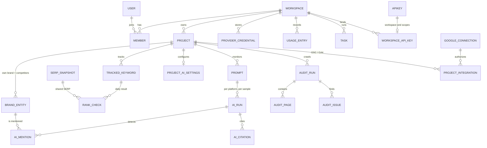

# Data model

The Prisma schema lives in `packages/db` (M1). This document defines the entities, the
rules every table follows, and how large time series are stored.

## Rules

1. **Tenant scoping.** Every tenant-owned row has `workspace_id`. Project-owned rows also have
   `project_id`. Repositories always filter by the workspace resolved from the request; a row
   is never loaded by ID alone.
2. **Identifiers.** Primary keys are UUIDs (`uuid`), v7 when generated by the application so
   they sort by creation time and work well for cursor pagination.
3. **Time.** All timestamps are `timestamptz`. Daily facts use a `date` column in the
   project's time zone.
4. **Money.** Provider costs are `numeric(12,6)` in USD.
5. **JSON.** `jsonb` is used for flexible payloads and is validated with Zod at the boundary.
6. **Shared market data.** Keyword metrics, domain metrics and DataForSEO locations are public
   market data, cached once per instance and shared by all workspaces.
7. **Large payloads.** Report PDFs (M4) and other large files go to object storage; tables
   keep a storage key and a hash. AI answers (a few kilobytes each) and the organic results
   of SERP snapshots are stored in the database.
8. **Naming.** Tables and columns are `snake_case` in PostgreSQL, mapped to `camelCase` in Prisma.

## Core relationships

## Identity and tenancy

Managed by Better Auth; our extra fields are added through its schema options.

| Table | Key columns | Notes |
|---|---|---|
| `user` | id, email, name, email_verified, image, locale, two_factor_enabled | |
| `session` | id, user_id, token, expires_at, active_organization_id, ip_address, user_agent | httpOnly cookie |
| `account` | id, user_id, provider_id, account_id, password (hash) | credentials and OAuth logins |
| `verification` | id, identifier, value, expires_at | email verification, password reset |
| `organization` | id, name, slug, logo, metadata, **plan**, **settings** | shown in the product as **workspace** |
| `member` | id, organization_id, user_id, role | roles: `owner`, `admin`, `member`, `viewer` |
| `invitation` | id, organization_id, email, role, status, expires_at, inviter_id | |
| `apikey` | id, reference_id (user), name, start, prefix, key (hash), enabled, rate limit (600 per minute), request_count, last_request, expires_at, metadata | Better Auth API keys; a key acts as its user |
| `workspace_api_key` | key_id (PK → `apikey`), workspace_id, scopes[] (`read`, `write`, `run:paid`), created_at | binds a key to one workspace with scopes; keys without a row are personal keys |

## Workspace-level entities

| Table | Key columns | Notes |
|---|---|---|
| `provider_credential` | id, workspace_id, provider, label, encrypted_secret (bytea), key_version, status, last_verified_at | providers: `DATAFORSEO`, `OPENAI`, `ANTHROPIC`, `GOOGLE_AI`, `OPENROUTER`, `PERPLEXITY`. Secrets are AES-256-GCM encrypted and never returned by the API |
| `usage_entry` | id, workspace_id, project_id?, task_id?, provider, operation, units, cost_usd, billed_to, created_at | append-only ledger, partitioned by month |
| `budget` | workspace_id, provider?, monthly_limit_usd, hard_stop, alert_thresholds | checked before paid jobs are enqueued |
| `task` | id, workspace_id, project_id?, type, status, progress, input, result, error, estimated_cost_usd, actual_cost_usd, idempotency_key, created_by, timestamps | user-visible background operation; unique (workspace_id, idempotency_key) |
| `audit_log` | id, workspace_id, actor_user_id?, actor_api_key_id?, action, target_type, target_id, metadata, ip, created_at | security-relevant actions |
| `notification` | id, workspace_id, user_id, type, title, body, link, read_at, created_at | in-app notifications |

## Provider cache

| Table | Key columns | Notes |
|---|---|---|
| `provider_cache` | key (SHA-256 of a versioned operation + canonical JSON params), provider, operation, params, response (jsonb), cost_usd, fetched_at, expires_at | shared market data only; never caches tenant-private data such as Search Console. Expired rows are deleted daily |

## Projects

| Table | Key columns | Notes |
|---|---|---|
| `project` | id, workspace_id, name, slug, domain, include_subdomains, default_location_code, default_language_code, timezone, archived_at | `domain` is a normalized host; unique (workspace_id, slug) |
| `brand_entity` | id, workspace_id, project_id, kind (`OWN`/`COMPETITOR`), name, domains[], aliases[], ambiguous_aliases[], color_slot | one `OWN` entity per project; competitors are entities too, so rank tracking, AI mentions and share of voice use one definition. Ambiguous names count only with supporting evidence ([geo-aeo.md](geo-aeo.md)); the color slot keeps a brand's color the same in every chart |
| `project_member` | project_id, user_id, role | M4: restrict client viewers to specific projects |
| `project_integration` | id, workspace_id, project_id, type (`GSC`/`GA4`), connection_id, external_id, display_name, settings, last_synced_at, synced_through, last_error | selected Search Console site (`sc-domain:example.com` or a URL prefix) or GA4 property (`properties/123`); unique (project_id, type) |
| `google_connection` | id, workspace_id, google_user_id, email, scopes[], encrypted_tokens (bytea), key_version, status (`ACTIVE`/`REVOKED`), last_error, oauth_client_id, connected_by | refresh and access tokens, AES-256-GCM encrypted; unique (workspace_id, google_user_id). `oauth_client_id` is the client that issued the tokens (`null` for the installation's, before workspace clients) |
| `google_oauth_client` | workspace_id (PK), client_id, encrypted_secret (bytea), key_version, verified_at, created_by | a workspace's own Google OAuth client; without one the installation's (`GOOGLE_CLIENT_ID`) is used |

## Rank tracking and keywords

| Table | Key columns | Notes |
|---|---|---|
| `keyword_metric` | keyword, location_code, language_code, search_volume, cpc, competition, competition_level, keyword_difficulty, intent, secondary_intents[], monthly_searches (jsonb), source, fetched_at | shared cache, PK (keyword, location_code, language_code); keywords without data are stored empty so they are not requested again |
| `tracked_keyword` | id, workspace_id, project_id, keyword, location_code, language_code, device, search_engine, tags[], target_url, frequency (`DAILY`/`WEEKLY`) | unique (project_id, keyword, location_code, language_code, device, search_engine) |
| `rank_check` | id, workspace_id, project_id, tracked_keyword_id, checked_on, status (`PENDING`/`COMPLETED`/`FAILED`), provider_task_id, posted_at, checked_at, depth, position, rank_absolute, url, serp_features[], owned_features[], ai_overview_present, ai_overview_cited, competitor_ranks (jsonb), serp_snapshot_id, cost_usd, error | unique (tracked_keyword_id, checked_on) |
| `serp_snapshot` | id, search_engine, keyword, location_code, language_code, device, fetched_on, fetched_at, depth, item_types[], results_count, organic (jsonb), features (jsonb), ai_overview (jsonb), check_url | shared market data: one SERP per query, market and day, reused by every project that tracks the query; kept 90 days |
| `keyword_list`, `keyword_list_item` | list: id, workspace_id, name · item: list_id, keyword, location_code, language_code, note | saved research |

`position` is the organic position (DataForSEO `rank_group`); `rank_absolute` counts every
SERP element. Search Console positions are **averages** and are stored separately
(`gsc_*_daily`), never mixed into `rank_check`.

## Search Console and Analytics facts

| Table | Key columns | Notes |
|---|---|---|
| `gsc_site_daily` | project_id, date, clicks, impressions, position | site totals, PK (project_id, date); they include the anonymized queries that the query table leaves out |
| `gsc_query_daily` | project_id, date, query, clicks, impressions, position | PK (project_id, date, query) |
| `gsc_page_daily` | project_id, date, page, clicks, impressions, position | PK (project_id, date, page) |
| `ga4_page_daily` | project_id, date, page (landing page path), channel, source, sessions, users, engaged_sessions, key_events | PK (project_id, date, page, channel, source) |

Positions are averages weighted by impressions; CTR is derived (clicks ÷ impressions) and not
stored. Imported rows belong to the project's current source: changing or removing a source
deletes them.

## Site audit

| Table | Key columns | Notes |
|---|---|---|
| `audit_run` | id, workspace_id, project_id, status, trigger, config (start URL, max pages, max depth), stats (jsonb: status classes, severities, crawl outcome, robots.txt, sitemaps, llms.txt, citability averages per factor), pages_crawled, health_score, score_version, citability_score, task_id, error, created_by, started_at, finished_at | `citability_score` is the average page citability |
| `audit_page` | id, run_id, url (normalized), depth, status_code, fetch_error, content_type, redirect_target, title, meta_description, h1, h1_count, canonical, robots_meta, indexable, word_count, content_hash, load_ms, bytes, inlinks, outlinks, external_links, schema_types[], lang, hreflang (jsonb), in_sitemap, citability_score, citability (jsonb: version, value and data per factor) | unique (run_id, url); citability only for indexable HTML pages |
| `audit_link` | run_id, from_page_id, to_url, anchor, nofollow | internal links only |
| `audit_issue` | id, run_id, page_id?, code, severity, data (jsonb) | `code` points to the issue catalog in `packages/contracts`; site-wide issues have no page |

Issue definitions (severity, category, scope) live in code; titles, explanations and fixes
are translated in the web app's message catalogs, not stored in the database.

## AI visibility (GEO/AEO)

| Table | Key columns | Notes |
|---|---|---|
| `project_ai_settings` | project_id (PK), workspace_id, platforms[], frequency (`WEEKLY`/`DAILY`), samples (1–5), models (jsonb: Claude and Perplexity model, `null` = default), sentiment | defaults (all platforms but Claude, weekly, one sample) apply until saved |
| `prompt` | id, workspace_id, project_id, text, location_code, language_code, tags[], active, created_by | the prompt library; unique (project_id, text, location_code, language_code) |
| `ai_run` | id, workspace_id, project_id, prompt_id, platform, method, model, sample_index, run_on, status (`PENDING`/`COMPLETED`/`FAILED`), provider_task_id, posted_at, completed_at, answer, answer_hash, web_search, fan_out_queries[], details (jsonb: search results, brand entities marked by the platform, token usage, check URL), detector_version, cost_usd, error | one answer; unique (prompt_id, platform, run_on, sample_index). Platforms: `CHATGPT`, `GEMINI`, `PERPLEXITY`, `CLAUDE`, `GOOGLE_AI_MODE`, `GOOGLE_AI_OVERVIEW` |
| `ai_mention` | run_id, entity_id, first_rank, first_offset, mention_count, sentiment, sentiment_confidence, classifier_version | PK (run_id, entity_id): one row per mentioned brand |
| `ai_citation` | run_id, rank, url, host, domain, title, entity_id?, page_url? | PK (run_id, rank): every cited source; `domain` is the registrable domain, `page_url` a known page of the project |

Dashboards aggregate answers, mentions and citations in SQL by period, platform and week;
a daily rollup table can be added when volumes need it. See [geo-aeo.md](geo-aeo.md) for
detection rules and metric formulas.

## Backlinks and domains (M4)

No tables of their own: domain and backlink data is public market data, cached for all
workspaces in `provider_cache` for 7 days; a refresh replaces an entry early (D23).
Trends come from DataForSEO's monthly history and new/lost series, never from differences
between stored totals. See [backend.md](backend.md#domain-overview-and-backlinks-m4).

## Reports and alerts (M4)

| Table | Key columns |
|---|---|
| `report_template` | id, workspace_id, name, sections (jsonb), branding (jsonb) |
| `report_schedule` | id, workspace_id, project_id, template_id, cron, timezone, recipients[], active, next_run_at |
| `report_run` | id, schedule_id?, project_id, status, file_key, period_start, period_end |
| `alert_rule` | id, workspace_id, project_id, type, config (jsonb), channels (jsonb), active |
| `alert_event` | id, rule_id, triggered_at, payload, delivery_status, delivered_at |

## Billing (cloud edition, M5)

| Table | Key columns | Notes |
|---|---|---|
| `subscription` | workspace_id (PK), stripe_customer_id, stripe_subscription_id, plan, status, current_period_end, cancel_at_period_end | mirror of Stripe state, written only by webhook handlers |
| `credit_grant` | id, workspace_id, source (`plan`, `top_up`, `manual`), credits, expires_at, created_at | monthly allowance and top-ups; spending is derived from `usage_entry` rows billed to the platform |
| `stripe_event` | event_id (PK), type, processed_at | processed webhook events; makes retries and replays no-ops |

## Time series and retention

- Daily facts are keyed by project and date and indexed for range scans
  (`rank_check (project_id, checked_on)`, the `gsc_*_daily` and `ga4_page_daily` primary
  keys). Monthly range partitioning of `rank_check`, `ai_run`, `usage_entry` and the
  `gsc_*_daily` tables is planned for when volumes need it; it was not needed in M2.
- `serp_snapshot` rows are deleted after 90 days; checks keep their positions and lose the
  link to the snapshot.
- Audit runs: the latest 10 runs per project keep pages, links and issues; older runs keep
  their summary stats and score only.
- Search Console and GA4 imports cover the last 90 days when a source is added and then grow
  by one day at a time.

## PostgreSQL and Supabase specifics

- Two connection strings: `DATABASE_URL` for the application (Supabase transaction pooler,
  port 6543) and `DIRECT_URL` for migrations (direct or session connection, port 5432).
- Row Level Security is **enabled on every table** with no policies, and no privileges are
  granted to the `anon` and `authenticated` roles. The application connects with its own
  role; nothing is reachable through Supabase's auto-generated Data API.
- Extensions are optional: `pg_partman` for partition maintenance, `vector` only when a
  feature actually uses embeddings.
